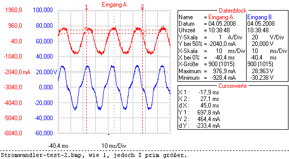

# Test paper
This is a quick example of live paper formatting.

Note to Gus - I have no opinions on the visual formatting here, the schema of the input json, etc.

This is just an example of the pipeline from json + data in a folder -> live paper.

## Notes to Gus
* This is here as an example of the data -> webpage pipline through flask
* I have no opinions on the input json schema, it's just an example
* Likewise, the visual formatting here is just an MVP 

I've written this in markdown for simplicty - if we want to use markdown there are lots of tools for rendering markdown to html, but you may already have plans. I've also seperated the markdown from the json, but only because it's easier to edit.

In other words - nothing here is final, fixed, or even opinionated - it's all a placeholder to give you an example to build up from.